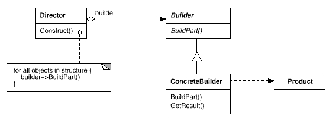
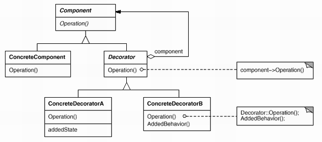

# Wzorce projektowe

# Budowniczy

Budowniczy (ang. Builder) jest wzorcem
dotyczącym tworzenia obiektów.
Celem jest oddzielenie tworzenia (budowania) skomplikowanych obiektów od ich implementacji.
Schemat tego wzorca ilustruje poniższy diagram:



Budowniczy ma metodę do dobudowywania kolejnych części oraz metodę dająca gotowy produkt.
Prawidłowe użycie polega na kolejnym wywoływaniu metody dobudowującej części do tworzonego produktu, a potem odebraniu 
gotowego produktu.  

Tu użyjemy Budowniczego do rozwiązania problemu braku w Javie parametrów z wartościami domyślnymi.

## Zadanie 0 
*Uwaga: to zadanie jeszcze nie korzysta ze wzorca Budowniczy, jest dopiero przygotowaniem do właściwego przykładu.
W zależności od dostępnego czasu można je rozwiązać, albo skorzystać z gotowego, dostarczonego z tymi materiałami, 
  rozwiązania.*

Zaimplementuj klasę wypisywacz. 
Jest to klasa usługowa, jej obiekty służą do wykonywania różnorakich operacji na wskazanym pliku.
Wypisywacz powinien dostarczać następujące metody:
* Konstruktor z jednym argumentem: nazwą pliku. Konstruktor nie wykonuje jeszcze żadnych operacji we/wy.
* Metodę *zapisz* (ona nas głównie interesuje) zapisująca na różne sposoby plik z Plikownika. 
  Ta metoda ma następujące parametry (Można by tu oczywiście podać jeszcze inne pożyteczne parametry):
  * ścieżka do pliku, który ma być utworzony (String),
  * czy poprzedzać wiersze ich numerami (boolean),
  * czy wypisywać wiersze wspak (boolean),
  * iloma znakami zastępować znak tabulacji, wartość -1 oznacza, żeby nie zastępować (int),
  * jakim znakiem zastępować znak tabulacji (char),
  * w jakim kodowaniu zapisać plik. 
* Metodę podającą liczbę znaków w pliki z Plikownika, bez znaków końca wiersza,
* Metodę podająca liczbę wierszy w pliku z Plikownika, 
* ... inne metody usługowe ...

Wywoływanie metody zapisz jest dość kłopotliwe - ma dużo parametrów, z których wszystkie (poza pierwszym) zwykle
  będą miały te same wartości (zwykle wierszy się nie numeruje, tabulacje zastępuje się czterema spacjami, 
  kolejności znaków w wierszach nie odwraca i używa kodowania UTF-8):
```java
wypisywacz.wypisz(jakśNazwa, false, false, -1, ' ', "UTF-8")
```
Przydałyby się tu parametry o wartościach domyślnych, ale nie ma ich w Javie.
Inne możliwe rozwiązania to zastosowanie teleskopowego przeciążania nazwy funkcji lub wzorzec Budowniczny.

Teleskopowe przeciążanie nazwy funkcji polega na zdefiniowaniu kolejnych wersji z coraz mniejszą liczbą parametrów:
```java
public void wypisz(String nazwaPlikuWy, boolean czyNumeryWierszy, boolean czyWierszeWspak, int tabIleSpacji, char tabWypełniacz,  String kodowanieWy){
    ...
}

public void wypisz(String nazwaPlikuWy, boolean czyNumeryWierszy, boolean czyWierszeWspak, int tabIleSpacji, char tabWypełniacz){
    wypisz(nazwaPlikuWy, czyNumeryWierszy, czyWierszeWspak, tabIleSpacji, tabWypełniacz,"UTF-8");
}

public void wypisz(String nazwaPlikuWy, boolean czyNumeryWierszy, boolean czyWierszeWspak, int tabIleSpacji){
    wypisz(nazwaPlikuWy, czyNumeryWierszy, czyWierszeWspak, tabIleSpacji, ' ');
}

public void wypisz(String nazwaPlikuWy, boolean czyNumeryWierszy, boolean czyWierszeWspak){
    wypisz(nazwaPlikuWy, czyNumeryWierszy, czyWierszeWspak, 4);
}

public void wypisz(String nazwaPlikuWy, boolean czyNumeryWierszy){
    wypisz(nazwaPlikuWy, czyNumeryWierszy, false);
}

public void wypisz(String nazwaPlikuWy){
    wypisz(nazwaPlikuWy, false);
}
```

[Plik z daną implementacją Plikownika](src/plikownik/Plikownik.java)

Wady tego rozwiązania to niepotrzebne komplikowanie klasy produktu: trzeba dopisać wiele (wprawdzie prostych) metod. 
Inna, poważniejsza wada, to niemożność pomijania innych niż ostatnie parametrów (np. nie można teraz wywołać *wypisz* 
  podając tylko nazwę pliku wyjściowego i jego kodowanie).  

Dlatego zastosujemy tu wzorzec Budowniczy.

## Zadanie 1
Napisz program, wywołujący operację *wypisz* z różnymi kombinacjami (co najmniej dwiema) parametrów. 
Do konstruowania zestawu parametrów użyj wzorca Budowniczy.
Budowniczy powinien mieć metody dodające kolejne parametry i jedną generującą produkt: obiekt z parametrami.
Zwróć uwagę na, i zaproponuj rozwiązanie dla, obsługi niespójnych zestawów parametrów (podany tabWypełniacz, 
  ale brak tabIleSpacji, albo brak nazwy pliku). 

[Rozwiązanie](src/Bob_Budowniczy/Budowniczy.java)

# Dekorator

Pozwala dynamicznie (tj. podczas działania programu) dodawać nowe funkcjonalności do obiektów. 

Schemat tego wzorca ilustruje poniższy diagram:



Komponent definiuje interfejs komponentów, ale nie musi być interfejsem w sensie Javy. 
Może być też klasą abstrakcyjną (a nawet konkretną, choć to mniej naturalne).
Może być wiele konkretnych komponentów (na diagramie jest jeden zwn. brak miejsca).
Kluczowym elementem tego wzorca jest dekorator dziedziczący po komponencie i zawierający składową będącą komponentem.
Ten zabieg pozwala tworzyć łańcuchy dekoratorów. 
Na końcu takiego łańcucha jest oczywiście (jakiś) konkretny komponent.

Wzorzec Dekorator pozwala dynamicznie dołączać (lub odłączać) nowe funkcjonalności do komponentu realizującego 
podstawowe funkcje w ten sposób, że kolejne dekoratory realizują swoje zadania (metoda *Operation* z diagramu), 
z potem wołają tę samą operację od udekorowanego sobą obiektu (który może być kolejnym dekoratorem).
Występuje tu zatem składanie (obiektów) i delegowanie (zadań).

## Zadanie 2
Rozważmy Wypisywacze - komponenty, które potrafią realizować następujące operacje:
* void wypiszZPliku(String ŚcieżkaWy) throws IOException,
* void wypiszWiersz(String wiersz) throws IOException,
* long ileWierszyWypisano(),
* long ileZnakówWypisano(),
* String dajNazwęPliku(),
* void close() throws IOException.
Każdy Wypisywacz ma pamiętać, do jakiego pliku ma wypisywać wiersze tekstu. 

Stwórz konkretny komponent wypisujący poszczególne wiersze tekstu do *PrintWritera* (ze standardowej biblioteki Javy). 
Zaimplementuj dekoratory, potrafiące:
* numerować wypisywane wiersze (od 1, po numerze należy jeszcze wypisać dwukropek i spację),
* odwracać wypisywane wiersze,
* zamieniać znaki tabulacji na podaną liczbę wskazanych znaków. 

Zastanów się, jak należy zadawać znak i liczbę dla ostatniego z podanych dekoratorów.
Napisz program testujący kilka konfiguracji dekoratorów.
Napisz przynajmniej jeden test jednostkowy, sprawdzający działanie wybranej konfiguracji dekoratorów.

Pamiętaj, że Twoje rozwiązanie nie musi być dokładną kopią diagramu opisującego wzorzec ("każde użycie wzorce będzie 
zapewne inne"). 
Możesz np. dodać własne klasy abstrakcyjne, gdy uznasz to za stosowane.

[Rozwiązanie zadania znajduje się w pakiecie *dekorator_wnętrz_obiektów*](src/dekorator_wnętrz_obiektów)

